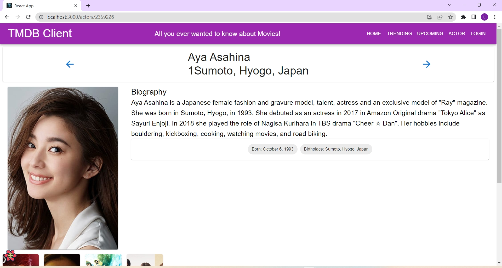
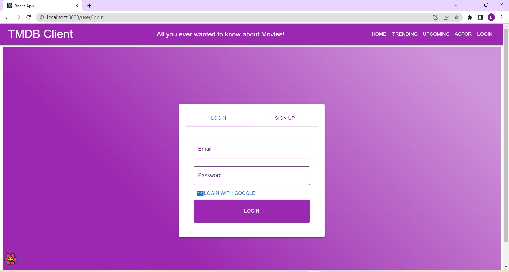
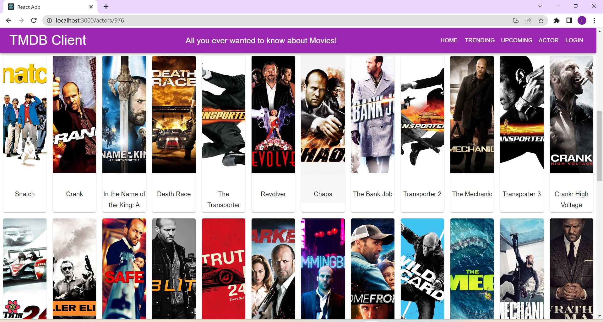

# Assignment 1 - ReactJS app.

Name: Haopeng Liang

## Overview.

This repository contains a ReactJS application, Movies Fan, which has been enhanced with several new features and functionalities. The app integrates with The Movie Database (TMDB) API to fetch and display movie data. The primary focus was to create an interactive and dynamic user experience by implementing advanced React features and integrating external APIs.

### Features.
The Movies Fan app now includes several new and enhanced features aimed at improving user engagement and experience:

+ **Dynamic Movie Carousel**: Showcases featured movies with engaging transition effects, enhancing the visual appeal.
    
    
+ **Filtering and Sorting**: Allows users to filter movies and actors based on various criteria like genre, popularity, name, and sort them in ascending or descending order.
    

    
    

+ **Pagination**: Facilitates efficient navigation through movie and actor lists, improving user experience for extensive data.
    

+ **Actor Profiles**: Offers in-depth information about actors, including biographical details, filmography, and associated images.
    

+ **Responsive Design**: Guarantees a seamless user experience across different devices and screen sizes.

+ **Firebase Authentication**: Incorporates user authentication features such as login, registration, and Google sign-in for enhanced security and personalized experience.
    
    
    

+ **Protected Routes**: Limits access to certain sections of the app exclusively to authenticated users, securing sensitive information.
    
    
    

+ **Movie and Actor Credits**: Presents detailed credits for each movie, including cast and crew, and showcases the movie credits for actors, providing a comprehensive view of their work.
    
    

+ **Enhanced Actor Discovery**: Introduces features to discover actors, including options to view popular actors, their images, and filter or sort them by gender, popularity, and name.
    
    

+ **Improved Movie Discovery**: Enriches the experience of exploring movies with added functionality to view trending movies, upcoming releases, and filter them by release dates and ratings.
    

## Setup requirements.

To run this application locally:

1. Clone the repository.

2. cd into movies directory.

3. Install dependencies using npm install.

4. Set up a .env file at the root with the necessary API keys and Firebase configuration, which including 

   REACT_APP_TMDB_KEY=
   REACT_APP_FIREBASE_API_KEY=
   REACT_APP_FIREBASE_AUTH_DOMAIN=
   REACT_APP_FIREBASE_PROJECT_ID=
   REACT_APP_FIREBASE_STORAGE_BUCKET=
   REACT_APP_FIREBASE_MESSAGING_SENDER_ID=
   REACT_APP_FIREBASE_APP_ID=
   REACT_APP_FIREBASE_MEASUREMENT_ID=
   FAST_REFRESH=false

5. Run the app using npm start.

## API endpoints.

1. **Movie Credits:**

+ Endpoint: /movie/{id}/credits
+ Description: Retrieves the cast and crew for a specific movie.
+ Implemented in: getMovieCredits
2. **Trending Movies:**

+ Endpoint: /trending/movie/week
+ Description: Fetches movies trending on a weekly basis.
+ Implemented in: getTrendingMovies
3. **Actor Details:**

+ Endpoint: /person/{id}
+ Description: Obtains detailed information about a particular actor.
+ Implemented in: getActor
4. **Popular Actors:**

+ Endpoint: /person/popular
+ Description: Retrieves a list of currently popular actors.
+ Implemented in: getPopularActors
5. **Actor Images:**

+ Endpoint: /person/{id}/images
+ Description: Fetches images related to a specific actor.
+ Implemented in: getActorImages
6. **Actor Movie Credits:**

+ Endpoint: /person/{id}/movie_credits
+ Description: Gets the movie credits of an actor.
+ Implemented in: getActorMovieCredits

## Routing.

1. Trending Movies Page:

+ Route: /movies/trending
+ Page: Displays a list of trending movies.
+ Component: TrendingMoviePage
2. Actor List Page:

+ Route: /actors
+ Page: Shows a list of popular actors.
+ Component: ActorListPage
3. Followed Actors Page:

+ Route: /actors/followed
+ Page: Displays actors that the user has chosen to follow.
+ Component: FollowedActorsPage
4. Actor Details Page:

+ Route: /actors/:id
+ Page: Provides detailed information about a specific actor.
+ Component: ActorDetailsPage
5. User Login Page:

+ Route: /user/login
+ Page: Allows users to log into their account.
+ Component: LoginPage
6. User Signup Page:

+ Route: /user/signup
+ Page: Enables new users to sign up for an account.
+ Component: LoginPage with type="signup"

Protected (Require Authentication):

- Favorites Management: Adding or viewing favorite movies or actors is restricted to authenticated users. This ensures that each user's favorites are personalized and secured.
- Followed Actors: The feature to follow actors and view a list of followed actors is available only to logged-in users, adding a layer of personalization to the user experience.

Public (No Authentication Required):

- Movie Browsing: Users can browse and view details of movies without needing to log in. This includes accessing lists of movies on different criteria (e.g. discover, trending, upcoming).
- Actor Browsing: Similar to movies, browsing through actor profiles and viewing their details is publicly accessible.
- General Navigation: Navigation through the app, accessing different routes like `/movies/trending`, `/actors`, etc., is available to all users, regardless of their authentication status.

## Independent learning (If relevant).

- **React Carousel Implementation**: Researched and implemented a dynamic movie carousel using React (src/components/carousel/index.js).
- **Firebase Integration for Authentication**: Studied Firebase authentication and integrated it into the app for secure user login and registration (src/contexts/AuthContext.js).
- **Advanced React Query Usage**:
  - **React Query's `useQueries` Hook**: The usage of `useQueries` can be seen in files where multiple asynchronous queries are managed concurrently, such as in fetching movie details or actor profiles (src/page/...).
  - **React Router's `useNavigate` Hook**: This hook is utilized in components where navigation between different routes is required based on user actions, such as after successful login or form submissions (src/components/.../template..../....).
- **Material UI Customization**:
  - **Material-UI's `@mui/material/colors`**: The application of Material-UI colors is evident in various UI components to maintain a consistent and appealing color scheme (whole project).
  - **Material-UI Pagination Component**: Implemented in list pages for handling the pagination of movies and actors.(src/page/homepage.js .etc).
  - **Material-UI Drawer and Tabs Components**: These components are used in the layout for navigational purposes, enhancing the user interface (drawer: src/components/siteHeader/index.js,                                                                          Tabs: components/userInfo/userLogin/index.js, components/userInfo/userSignup/index.js).

References:

- React Carousel: [React Slick](https://react-slick.neostack.com/)
- Firebase Authentication: [Firebase Docs](https://firebase.google.com/docs/auth)
- React Query and Queries: [React Query Docs](https://react-query.tanstack.com/), [React Query's useQueries Docs](https://react-query.tanstack.com/reference/useQueries)
- Material UI: [Drawer][https://mui.com/material-ui/react-drawer/], [Tabs](https://mui.com/material-ui/react-tabs/), [Pagination](https://mui.com/material-ui/react-pagination/), and [Material-UI Colors](https://mui.com/material-ui/customization/color/)
